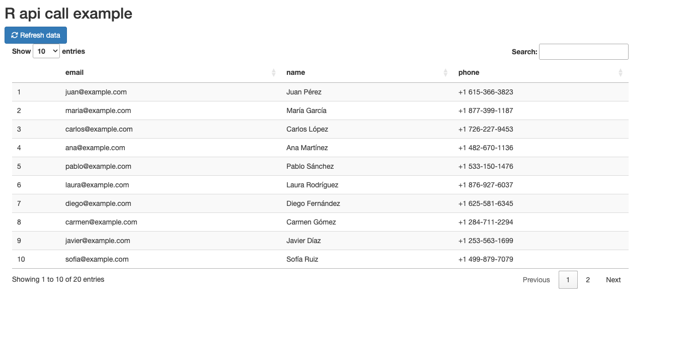

## Real-time Data Visualization with R Shiny and External APIs

Today we will create a simple R Shiny frontend application that fetches real-time data from an external API. First we
have a backend API that provides a simple JSON response protected by a bearer token.

```python
import random
from functools import wraps

from flask import Flask, jsonify, request

app = Flask(__name__)

VALID_TOKEN = "api-secret-token"


def token_required(valid_token=VALID_TOKEN):
    def decorator(f):
        @wraps(f)
        def decorated(*args, **kwargs):
            token = None
            auth_header = request.headers.get('Authorization')
            if auth_header and auth_header.startswith('Bearer '):
                token = auth_header.split(' ')[1]

            if not token or token != valid_token:
                return jsonify({'message': 'Not valid token'}), 401

            return f(*args, **kwargs)

        return decorated

    return decorator


def generate_phone_number():
    area_code = random.randint(200, 999)
    prefix = random.randint(100, 999)
    line = random.randint(1000, 9999)
    return f"+1 {area_code}-{prefix}-{line}"


@app.get('/data')
@token_required(valid_token=VALID_TOKEN)
def get_data():
    return jsonify([
        {"phone": generate_phone_number(), "name": "Juan Pérez", "email": "juan@example.com"},
        {"phone": generate_phone_number(), "name": "María García", "email": "maria@example.com"},
        {"phone": generate_phone_number(), "name": "Carlos López", "email": "carlos@example.com"},
        {"phone": generate_phone_number(), "name": "Ana Martínez", "email": "ana@example.com"},
        {"phone": generate_phone_number(), "name": "Pablo Sánchez", "email": "pablo@example.com"},
        {"phone": generate_phone_number(), "name": "Laura Rodríguez", "email": "laura@example.com"},
        {"phone": generate_phone_number(), "name": "Diego Fernández", "email": "diego@example.com"},
        {"phone": generate_phone_number(), "name": "Carmen Gómez", "email": "carmen@example.com"},
        {"phone": generate_phone_number(), "name": "Javier Díaz", "email": "javier@example.com"},
        {"phone": generate_phone_number(), "name": "Sofía Ruiz", "email": "sofia@example.com"},
        {"phone": generate_phone_number(), "name": "Miguel Álvarez", "email": "miguel@example.com"},
        {"phone": generate_phone_number(), "name": "Lucía Jiménez", "email": "lucia@example.com"},
        {"phone": generate_phone_number(), "name": "Alejandro Moreno", "email": "alejandro@example.com"},
        {"phone": generate_phone_number(), "name": "Elena Muñoz", "email": "elena@example.com"},
        {"phone": generate_phone_number(), "name": "David Alonso", "email": "david@example.com"},
        {"phone": generate_phone_number(), "name": "Natalia Torres", "email": "natalia@example.com"},
        {"phone": generate_phone_number(), "name": "Roberto Gutiérrez", "email": "roberto@example.com"},
        {"phone": generate_phone_number(), "name": "Cristina Navarro", "email": "cristina@example.com"},
        {"phone": generate_phone_number(), "name": "Antonio Ramos", "email": "antonio@example.com"},
        {"phone": generate_phone_number(), "name": "Isabel Ortega", "email": "isabel@example.com"}
    ])
```

The frontend application is a simple R Shiny app that fetches data from the API and displays it in a table. The app also
includes a button to refresh the data.

We'll use renv to manage the R package dependencies. To set up the environment, run the following commands in your R
console:

```R
install.packages("renv")
renv::init()
```

Then, install the required packages:

```R
install.packages("shiny")
install.packages("readxl")
install.packages("dplyr")
install.packages("qcc")
install.packages("ggplot2")
install.packages("shinyWidgets")
install.packages("dotenv")
install.packages("DT")
install.packages("httr")
install.packages("jsonlite")

renv::snapshot()
```

That's the main.R file.

```R
library(shiny)

source("api_client.R")

args <- commandArgs(trailingOnly = TRUE)
port <- if (length(args) >= 1) as.numeric(args[1]) else 3838
host <- if (length(args) >= 2) args[2] else "0.0.0.0"
launch_browser <- if (length(args) >= 3) as.logical(args[3]) else TRUE

runApp("app.R", port = port, host = host, launch.browser = launch_browser)
```

And the shiny app is in the app.R file.

```R
library(shiny)

library(ggplot2)
library(dplyr)
library(shinyWidgets)
library(dotenv)
library(DT)

df <- data.frame()
load_dot_env()

config <- list(
  api_url = Sys.getenv("API_URL"),
  api_token = Sys.getenv("API_KEY")
)

ui <- fluidPage(
  titlePanel("R api call example"),

  fluidRow(
    column(12,
           actionButton("refresh", "Refresh data", icon = icon("refresh"), class = "btn-primary")
    )
  ),

  mainPanel(
    DTOutput("table")
  )
)

server <- function(input, output, session) {
  data <- reactiveVal(df)

  refreshData(data, config$api_url, config$api_token)

  observeEvent(input$refrescar, {
    refreshData(data, config$api_url, config$api_token)
  })

  output$table <- renderDT({
    data()
  })
}

shinyApp(ui = ui, server = server)
```

We're also using dotenv to manage environment variables. Create a `.env` file in the root of your project with the following content:

```dotenv
API_URL=http://localhost:5000/data
API_KEY=api-secret-token 
```

